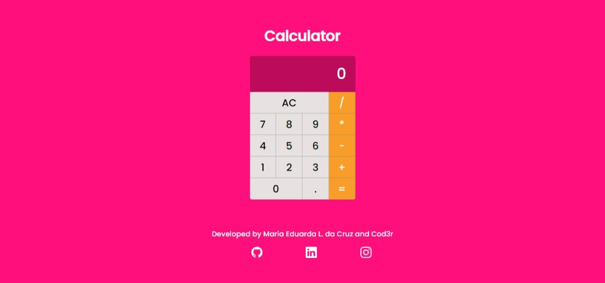

# 📲 React Calculator

Full Modern Web with Javascript Course calculator project from Udemy developed by instructor Leonardo.

## Table of contents

- About
    - Functionality
    - Screenshot
- My process
    - Technologies
    - Development Tools
- What I've learned?
- Author
    - Instructor and Course
    - Social Media

## About

### ⚙️ Functionality

The user must be able to:

- Clear display
- Click on the button and see the numbers on the display
- Do the following operations:
    - Sum
    - Subtraction
    - Division
    - Multiplication

### 📸 Screenshot

## My process

### 💻 Technologies

### 🛠️ Development Tools

- Visual Studio Code
- Git
- Gitbash
- Webpack

## 👩🏽‍💻What I've learned?

- Set up a React Environment
- React Render
- React Components
- React Class
- React Props

## 📍 Author

Instructor: Leonardo Moura Leitão (Software architect)

Developer: Maria Eduarda Leitão da Cruz

Course platform: Udemy, Cod3r.

Cod3r Website: [Cod3r](www.cod3r.com.br)

